# My Bank Demo

## Module 1: Khởi tạo dự án:

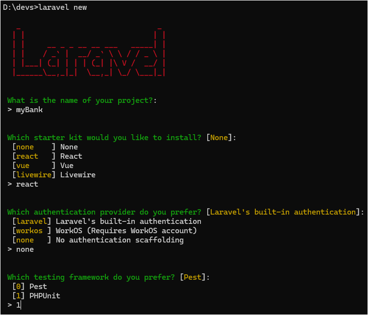
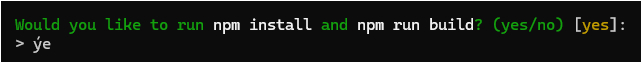
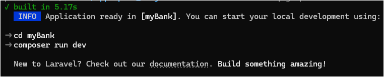

**`Lưu ý:`** Việc lựa chọn **_`none`_** cho option **`Which authentication provider do you perfer?`**, giúp cho việc khởi tạo dự án dễ dàng hơn,
không cần phải xóa các file không cần thiết trong thư mục `resources/ routes/ controllers`.

---

## Sử dụng và Hiểu vai trò của APP_KEY

### 1. Bảo mật dữ liệu mã hóa

Laravel sử dụng **APP_KEY** làm secret để mã hóa và giải mã dữ liệu, ví dụ:

- `Crypt::encrypt()` và `Crypt::decrypt()`
- Mã hóa cookie và session (khi sử dụng driver mã hóa)

### 2. Xác thực dữ liệu

APP_KEY giúp framework tạo và xác thực các token bảo mật (ví dụ: CSRF token), đảm bảo rằng dữ liệu không bị thay đổi trái phép.

### 3. Ngăn chặn rò rỉ bảo mật

Nếu không có APP_KEY hợp lệ, các dữ liệu mã hóa sẽ không thể giải mã đúng, gây lỗi bảo mật và khiến ứng dụng không hoạt động bình thường.

### 4. Áp dụng APP_KEY vào dự án:
*Lưu ý phần khởi tạo app_key này nhằm mục đích giới thiệu thêm, lớp mình không cần làm vẫn được*

```bash
PS C:\devs\laravel\myBank> php artisan key:generate

INFO  Application key set successfully.
```

Lệnh `php artisan key:generate` trong Laravel tạo ra **Application Key (APP_KEY)** — một chuỗi mã hóa ngẫu nhiên dài 32 ký tự — và ghi nó vào file `.env` của dự án Laravel.

```env
APP_NAME=Laravel
APP_ENV=local
APP_KEY=base64:KsJCCYKvWX/nGEW+hr89+mRR5ya0wAwOLVMJfR6exiE=
APP_DEBUG=true
```

---

## Chỉnh DB trong `.env`

```env
DB_CONNECTION=mysql
DB_HOST=127.0.0.1
DB_PORT=3306
DB_DATABASE=laravel
DB_USERNAME=myBankDB
DB_PASSWORD=root
```

Tạo Database trong MySQL trước khi migrate.

Login vô MySQL Workbench:
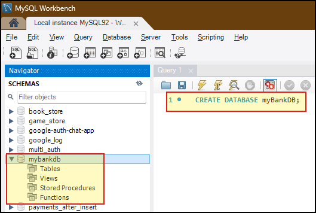

```sql
CREATE DATABASE myBankDB;
```

Sau đó chạy lệnh migrate:

```bash
php artisan migrate
```

---

## Module 2: Vite + React + Blade shell

### Kiểm tra cấu hình Vite — vị trí lưu trữ

```ts
input: ['resources/css/app.css', 'resources/js/app.tsx'],
ssr: 'resources/js/ssr.tsx',
```

#### `vite.config.ts`

```ts
import tailwindcss from '@tailwindcss/vite';
import react from '@vitejs/plugin-react';
import laravel from 'laravel-vite-plugin';
import { resolve } from 'node:path';
import { defineConfig } from 'vite';

export default defineConfig({
    plugins: [
        laravel({
            input: ['resources/css/app.css', 'resources/js/app.tsx'],
            ssr: 'resources/js/ssr.tsx',
            refresh: true,
        }),
        react(),
        tailwindcss(),
    ],
    esbuild: {
        jsx: 'automatic',
    },
    resolve: {
        alias: {
            'ziggy-js': resolve(__dirname, 'vendor/tightenco/ziggy'),
        },
    },
});
```

---

### Cấu hình lại file `app.tsx` bằng cách đổi extension `.tsx` → `.jsx`

```tsx
import '../css/app.css';

import { createInertiaApp } from '@inertiajs/react';
import { resolvePageComponent } from 'laravel-vite-plugin/inertia-helpers';
import { createRoot } from 'react-dom/client';

const appName = import.meta.env.VITE_APP_NAME || 'Laravel';

createInertiaApp({
    title: (title) => (title ? `${title} - ${appName}` : appName),
    resolve: (name) => resolvePageComponent(`./pages/${name}.jsx`, import.meta.glob('./pages/**/*.jsx')),
    setup({ el, App, props }) {
        const root = createRoot(el);
        root.render(<App {...props} />);
    },
    progress: {
        color: '#4B5563',
    },
});
```

Toàn bộ đường dẫn trong `resolve` có link folder bắt đầu với `/pages` phải được đổi sang `.jsx` để đồng bộ với extension mới trong thư mục **`pages`**.

---

### `app.blade.php` sau khi điều chỉnh extension `.jsx`

```php
<!DOCTYPE html>
<html lang="{{ str_replace('_', '-', app()->getLocale()) }}" @class(['dark' => ($appearance ?? 'system') == 'dark'])>
    <head>
        <meta charset="utf-8">
        <meta name="viewport" content="width=device-width, initial-scale=1">

        <title inertia>{{ config('app.name', 'Laravel') }}</title>

        <link rel="icon" href="/favicon.ico" sizes="any">
        <link rel="icon" href="/favicon.svg" type="image/svg+xml">
        <link rel="apple-touch-icon" href="/apple-touch-icon.png">

        <link rel="preconnect" href="https://fonts.bunny.net">
        <link href="https://fonts.bunny.net/css?family=instrument-sans:400,500,600" rel="stylesheet" />

        @routes
        @viteReactRefresh
        @vite(['resources/js/app.tsx', "resources/js/pages/{$page['component']}.jsx"])
        @inertiaHead
    </head>
    <body class="font-sans antialiased">
        @inertia
    </body>
</html>
```

Trong phần `@vite` tuyệt đối không chỉnh sửa **`app.tsx`**, chỉ thay đổi những file phía sau folder **`/pages`** thành đuôi _`.jsx`_ thôi.

---

### Hoàn tất Module 1 + 2

Dự án đã **cài đặt Laravel + Vite + React + Inertia** xong, cấu hình Blade shell cũng chuẩn hóa sang `.jsx`.
Từ đây có thể coi project như **template base** để tái sử dụng nhiều lần.

## Cách lưu trữ template

### 1. Zip project

- Giữ lại toàn bộ code, config, inertia…
- Khi cần khởi tạo project mới, chỉ cần giải nén, `composer install`, `npm install`, tạo `.env` mới và chạy migrate.

### 2. Push lên GitHub

```bash
# Tạo repo mới trên GitHub: my-laravel-react-template
```

### Lời khuyên

- Nên để tên repo rõ ràng như:
  **`laravel12-vite-react-inertia-template`**.
- Nếu muốn dùng làm **base cho nhiều dự án**, hãy tạo **branch riêng** (ví dụ `template-base`) và giữ branch này không đổi, còn các dự án cụ thể thì tạo branch mới từ đó.

---

### Chỉnh sửa thông báo cho người dùng về PORT:5173

#### File chỉnh sửa: `node_modules\laravel-vite-plugin\dist\dev-server-index.html`

```html
<!DOCTYPE html>
<html lang="en">
    <head>
        <meta charset="UTF-8" />
        <meta name="viewport" content="width=device-width, initial-scale=1.0" />
        <title>Restricted Page</title>
    </head>
    <body style="background: black; text-align: center; padding-top: 100px;">
        <h1 style="color: red; font-family: sans-serif;">You are not allowed to enter this page.</h1>
        <p style="color: #ccc; font-size: 18px;">
            This project runs on <strong>PHP (Laravel)</strong> using port <strong>8000</strong> (or customized port like <strong>9999</strong>). The
            default Vite port <strong>:5173</strong> is no longer used.
        </p>
        <a
            href="http://127.0.0.1:9999"
            style="display: inline-block; margin-top: 30px; padding: 12px 24px; 
              background: red; color: white; text-decoration: none; 
              border-radius: 6px; font-weight: bold;"
        >
            Please go back to Home Page
        </a>
    </body>
</html>
```

#### **Giải thích thay đổi:**

- Thêm thông báo rõ ràng rằng dự án **chạy trên PHP (Laravel)** và port sử dụng là `8000` hoặc `9999`.
- Thông báo rằng port mặc định `:5173` của Vite không còn được dùng nữa.
- Link quay về trang Laravel (`http://127.0.0.1:9999`).

---

### Setup Frontend: Đăng ký middleware Inertia

Mặc định laravel đã tạo `app/Http/Middleware/HandleInertiaRequests.php`.
Đoạn mã bên dưới là `middleware` của Laravel, cụ thể là lớp _HandleInertiaRequests_ kế thừa từ _Inertia\Middleware_.
Middleware này đóng vai trò **cầu nối giữa Laravel backend và Inertia.js frontend** khi xử lý request.

#### `app/Http/Middleware/HandleInertiaRequests.php`

```php
<?php

namespace App\Http\Middleware;

use Illuminate\Foundation\Inspiring;
use Illuminate\Http\Request;
use Inertia\Middleware;
use Tighten\Ziggy\Ziggy;

class HandleInertiaRequests extends Middleware
{
    /**
     * The root template that's loaded on the first page visit.
     *
     * @see https://inertiajs.com/server-side-setup#root-template
     *
     * @var string
     */
    protected $rootView = 'app';

    /**
     * Determines the current asset version.
     *
     * @see https://inertiajs.com/asset-versioning
     */
    public function version(Request $request): ?string
    {
        return parent::version($request);
    }

    /**
     * Define the props that are shared by default.
     *
     * @see https://inertiajs.com/shared-data
     *
     * @return array<string, mixed>
     */
    public function share(Request $request): array
    {
        [$message, $author] = str(Inspiring::quotes()->random())->explode('-');

        return [
            ...parent::share($request),

            'name' => config('app.name'),

            'quote' => [
                'message' => trim($message),
                'author'  => trim($author),
            ],

            'auth' => [
                'user' => $request->user(),
            ],

            'flash' => [
                'success' => fn() => $request->session()->get('success'),
                'error'   => fn() => $request->session()->get('error'),
            ],

            'ziggy' => fn(): array => [
                ...(new Ziggy)->toArray(),
                'location' => $request->url(),
            ],

            'sidebarOpen' => ! $request->hasCookie('sidebar_state')
                || $request->cookie('sidebar_state') === 'true',

            'csrf_token' => csrf_token(),
        ];
    }
}
```

#### Lưu ý quan trọng:

##### Cần thêm vào đoạn mã này 2 cái keys là 'flash' & "csrf_token" :

```php
            'flash' => [
                'success' => fn() => $request->session()->get('success'),
                'error'   => fn() => $request->session()->get('error'),
            ],

            'csrf_token' => csrf_token(),
```

- `flash`: truyền thông báo **thành công/thất bại** để hiển thị notification phía frontend.
- `csrf_token`: mã chống **Cross‑Site Request Forgery**; gửi kèm trong form hoặc header (`X-CSRF-TOKEN`) để Laravel xác thực các request thay đổi trạng thái (POST/PUT/PATCH/DELETE).

##### Ngoài ra Middleware này còn:
- Chỉ định layout Blade gốc (app).
- Tự động chia sẻ dữ liệu chung (tên app, quote, thông tin user, routes Ziggy, trạng thái sidebar) với mọi response Inertia.
- Hỗ trợ frontend nhận thông tin server mà không cần gọi API riêng.

---

### Khởi tạo CSS mặc định cho dự án:

##### resources\css\app.css
```CSS
:root {
    --primary: #0b57d0;
    --border: #e5e7eb;
    --bg: #f9fafb;
}
* {
    box-sizing: border-box;
}
html,
body {
    margin: 0;
    padding: 0;
    font-family: system-ui, Arial, sans-serif;
    background: var(--bg);
    color: #111;
}
a {
    color: var(--primary);
    text-decoration: none;
}
.container {
    max-width: 960px;
    margin: 0 auto;
    padding: 16px;
}
.card {
    background: #fff;
    border: 1px solid var(--border);
    border-radius: 8px;
    padding: 16px;
}
.btn {
    background: var(--primary);
    color: #fff;
    border: none;
    padding: 10px 14px;
    border-radius: 6px;
    cursor: pointer;
}
.btn:disabled {
    opacity: 0.6;
    cursor: not-allowed;
}
.input {
    width: 100%;
    padding: 10px;
    border: 1px solid var(--border);
    border-radius: 6px;
}
.form-row {
    display: flex;
    gap: 12px;
    margin-bottom: 12px;
}
label {
    display: block;
    margin-bottom: 6px;
    font-weight: 600;
}
.error {
    font-size: 14px;
    margin: 12px 0;
    padding: 10px;
    border: 1px solid #fed7d7;
    background-color: #fff5f5;
    color: #c53030;
}
.success {
    font-size: 14px;
    margin: 12px 0;
    padding: 10px;
    border: 1px solid #c6f6d5;
    background-color: #f0fff4;
    color: #2f855a;
}
.nav {
    display: flex;
    gap: 12px;
    padding: 12px 0;
    border-bottom: 1px solid var(--border);
    margin-bottom: 16px;
}

```

---

### Viết trang Welcome đầu tiên:

##### resources/js/Pages/Welcome.jsx
*Lưu ý tên Welcome đã được viết in hoa chữ W, hãy thay đổi cho cả tên file & function.*

```jsx
import MainLayout from '../pages/layouts/MainLayout';

export default function Welcome({ appNameFromPHP }) {
    return (
        <MainLayout>
            <div className="card">
                <h1>{appNameFromPHP}</h1>
                <p>Welcome to My Bank.</p>
                <a href="/login">Login</a> . <a href="/register">Register</a>
            </div>
        </MainLayout>
    );
}
```

***Sau khi đã thiết kế xong phần View hiển thị, nhằm mục đích kết nối với client thì phải nhớ thêm Route.***

##### routes\web.php
Mặc định Laravel đã khởi tạo sẵn một route với http method là `get()`, sử dụng method `render` của class `Inertia` nhằm mục đích trả về giao diện React.
Nên tên component phải là `Welcome` (chữ hoa đầu) thay vì `welcome`.

```php
<?php

use Illuminate\Support\Facades\Route;
use Inertia\Inertia;

Route::get("/", fn() => Inertia::render("Welcome", ['appNameFromPHP' => config("app.name", "myBank")]));

require __DIR__ . '/settings.php';
require __DIR__ . '/auth.php';

```

---

### Điều chỉnh lại PORT và Khởi chạy dự án

##### Chỉnh PORT tại file composer.json
**Nếu muốn thay đổi PORT lại thành :9999, thì làm theo ảnh bên dưới (PORT mặc định là :8000)**
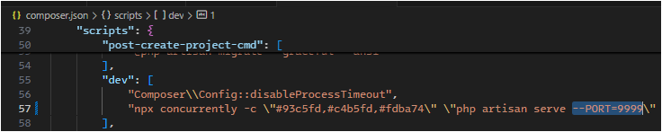

**Khởi chạy dự án**
```bash
composer run dev
```

---

# Module 3 — Layouts, Nav, chia bố cục

## 1. Tạo Layout chung

**File:** `resources/js/Layouts/MainLayout.jsx`

## 2. Import

```jsx
import { Link, usePage } from '@inertiajs/react';
```

* **`Link`**: Component của InertiaJS thay thế thẻ `<a>` truyền thống, giúp điều hướng mà không cần reload trang.
* **`usePage`**: Hook để lấy dữ liệu props mà server Laravel gửi xuống thông qua Inertia.

## 3. Khai báo `MainLayout`

```jsx
export default function MainLayout({ children }) {
    const { props } = usePage();
    const user = props.auth?.user;

    return (
        <div className="container">
            <nav className="nav">
                <Link href={'/'}>MyBank</Link>
                <div>
                    {user ? (
                        <>
                            <Link href={'/dashboard'}>Dashboard</Link>
                            <Link
                                href={'/logout'}
                                method="post"
                                as="button"
                                className="btn"
                            >
                                Logout
                            </Link>
                        </>
                    ) : (
                        <>
                            <Link href={'/login'}>Login</Link>
                            <Link href={'/register'}>Register</Link>
                        </>
                    )}
                </div>
            </nav>
            {children}
        </div>
    );
}
```

## 4. Giải thích chi tiết

* **`MainLayout`**: Layout tổng (giống master layout trong Blade), bao bọc các page con.
* **`children`**: Nội dung của từng trang sẽ được render bên trong layout.
* **`usePage()`**: Lấy props từ server.
* **`user = props.auth?.user`**: Kiểm tra trạng thái đăng nhập.

### Điều kiện hiển thị:

* **Trường hợp 1: User đã đăng nhập**

  * Hiển thị link **Dashboard**.
  * Hiển thị nút **Logout**.

    * `method="post"`: gửi request POST khi logout.
    * `as="button"`: render ra thẻ `<button>`.
    * `className="btn"`: gắn CSS class.

* **Trường hợp 2: User chưa đăng nhập**

  * Hiển thị link **Login**.
  * Hiển thị link **Register**.

## 5. Tóm gọn

Đây là một **Main Layout component** trong **InertiaJS + React**:

* Lấy thông tin user từ props (qua `usePage`).
* Nếu user đã login → hiển thị **Dashboard + Logout**.
* Nếu chưa login → hiển thị **Login + Register**.
* Nội dung từng page được chèn vào **`{children}`**.

---

# 2. Dùng Layout trong trang

## Sửa `resources/js/Pages/Welcome.jsx`

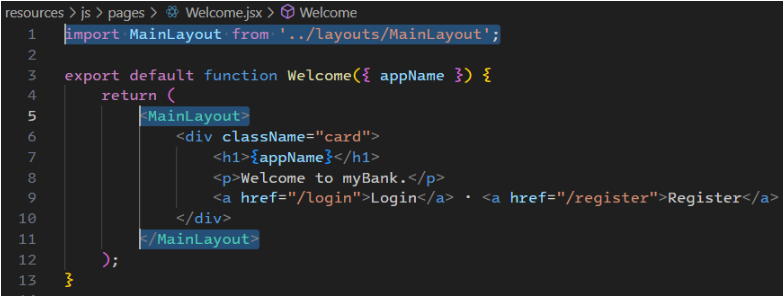

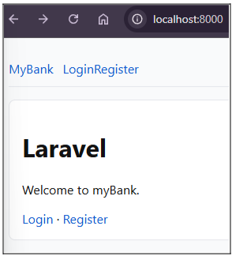

## Chỉnh lại Inline CSS bên component MainLayout

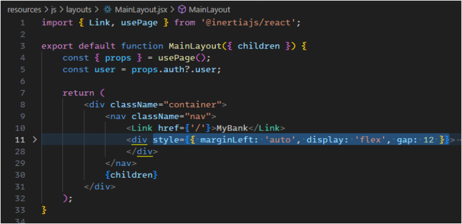

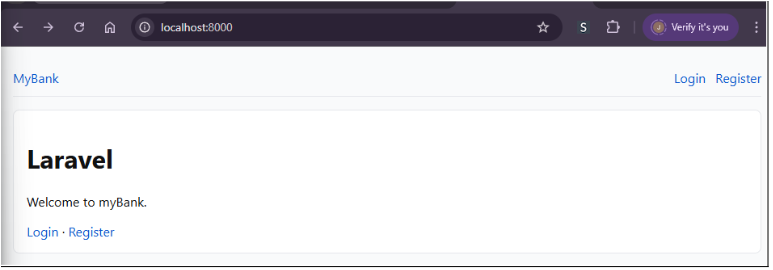

Như vậy, `Welcome.jsx` đã được bọc bởi **MainLayout**, đồng thời thêm CSS để bố cục gọn gàng hơn.

---

# Module 4 — Thiết kế Authentication

## 1. Migration `users`

Laravel mặc định đã có bảng **`users`** với các cột:

* `id` (primary key)
* `name` (string)
* `email` (unique)
* `password` (string, hashed bằng `Hash::make()`)

Không cần chỉnh sửa thêm nếu chỉ cần đăng ký/đăng nhập cơ bản.

## 2. Tạo Controller

```bash
php artisan make:controller Auth/RegisteredUserController
php artisan make:controller Auth/AuthenticatedSessionController
```

## 3. Routes Auth

**File:** `routes/auth.php`

```php
<?php

use App\Http\Controllers\Auth\AuthenticatedSessionController;
use App\Http\Controllers\Auth\RegisteredUserController;
use Illuminate\Support\Facades\Route;

// Routes cho khách (chưa đăng nhập)
Route::middleware("guest")->group(function () {
    // Login
    Route::get("/login", [AuthenticatedSessionController::class, "create"])
        ->name("login");
    Route::post("/login", [AuthenticatedSessionController::class, "store"]);

    // Register
    Route::get("/register", [RegisteredUserController::class, "create"])
        ->name("register");
    Route::post("/register", [RegisteredUserController::class, "store"]);
});

// Logout (chỉ cho user đã đăng nhập)
Route::post("/logout", [AuthenticatedSessionController::class, "destroy"])
    ->middleware("auth");
```

## 4 Route `web.php`: thêm liên kết tới `/dashboard`

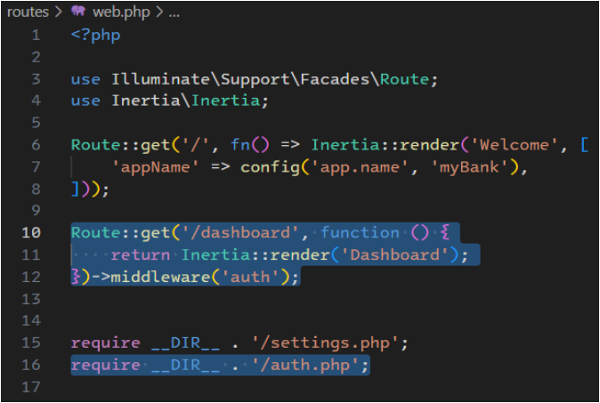

* Truy cập `/dashboard` sẽ render component **`Dashboard`**.
* Áp dụng middleware **`auth`** → chỉ truy cập khi đã đăng nhập, nếu chưa sẽ bị chuyển hướng về `/login`.

## Giải thích lệnh Import thêm route từ file khác

```php
require __DIR__ . '/settings.php';
require __DIR__ . '/auth.php';
```

* Chia nhỏ route để mã nguồn gọn gàng:

  * `settings.php`: các route cài đặt (profile, theme, …).
  * `auth.php`: các route login, register, logout (như đã trình bày ở trên).

---

## 5. Controllers

### Truy cập vào controller đã tạo `app/Http/Controllers/Auth/RegisteredUserController.php`

#### 1) Khai báo namespace & import

```php
<?php

namespace App\Http\Controllers\Auth;

use App\Http\Controllers\Controller;
use App\Models\User;
use Illuminate\Http\RedirectResponse;
use Illuminate\Http\Request;
use Illuminate\Support\Facades\Auth;
use Illuminate\Support\Facades\Hash;
use Inertia\Inertia;
use Inertia\Response;
```

* `namespace App\Http\Controllers\Auth;` → file controller nằm trong thư mục `app/Http/Controllers/Auth`.
* `User` → model kết nối với bảng `users`.
* `Auth` → Facade xử lý đăng nhập/đăng xuất.
* `Hash` → băm (mã hóa một chiều) mật khẩu.
* `Inertia` → render React/Vue component.
* `Response`, `RedirectResponse` → kiểu dữ liệu trả về.

#### 2) Hàm `create`

```php
public function create(): Response
{
    return Inertia::render('auth/Register');
}
```

* Trả về Inertia view: `auth/Register` (component React/Vue).

**Route tương ứng:**

```php
Route::get('/register', [\App\Http\Controllers\Auth\RegisteredUserController::class, 'create'])
    ->name('register');
```

#### 3) Hàm `store`

```php
public function store(Request $request): RedirectResponse
{
    $data = $request->validate([
        'name' => ['required', 'string', 'max:255'],
        'email' => [
            'required',
            'string',
            'email',
            'max:255',
            'unique:users,email',
        ],
        'password' => ['required', 'string', 'min:6', 'confirmed'],
    ]);

    $user = User::create([
        'name'     => $data['name'],
        'email'    => $data['email'],
        'password' => Hash::make($data['password']),
    ]);

    Auth::login($user);

    return redirect()->intended('/dashboard')
        ->with('success', 'Register Successfully!');
}
```

* `validate(...)`:

  * `name`: bắt buộc, chuỗi, tối đa 255 ký tự.
  * `email`: bắt buộc, đúng định dạng, không trùng trong `users`.
  * `password`: bắt buộc, ≥ 6 ký tự, xác nhận với `password_confirmation`.

#### 4) Tạo user mới

```php
$user = User::create([
    'name'     => $data['name'],
    'email'    => $data['email'],
    'password' => Hash::make($data['password']),
]);
```

* Mật khẩu được `Hash::make(...)` để bảo mật.

#### 5) Đăng nhập ngay sau khi đăng ký

```php
Auth::login($user);
```

#### 6) Redirect về Dashboard + flash message

```php
return redirect()->intended('/dashboard')
    ->with('success', 'Register Successfully!');
```

* `intended(...)`: nếu trước đó truy cập trang yêu cầu login, sẽ quay lại trang đó; mặc định tới `/dashboard`.
* `with('success', ...)`: đính kèm flash message.

### Kiểm tra lại code như ảnh bên dưới:

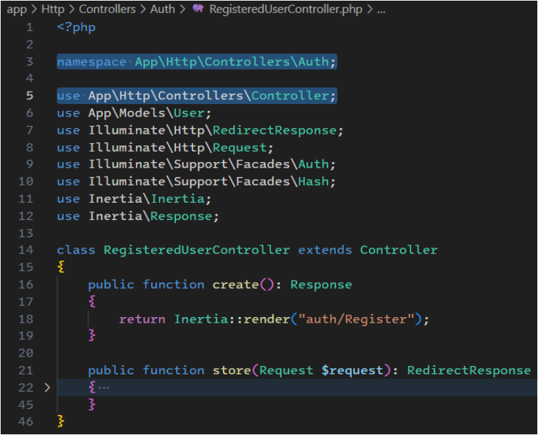

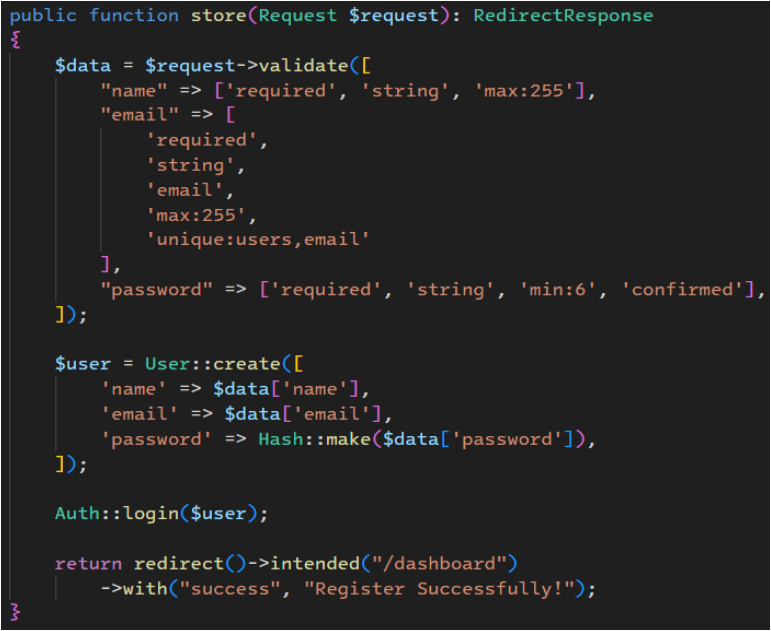

---

### Truy cập vào controller đã tạo `app/Http/Controllers/Auth/AuthenticatedSessionController.php`

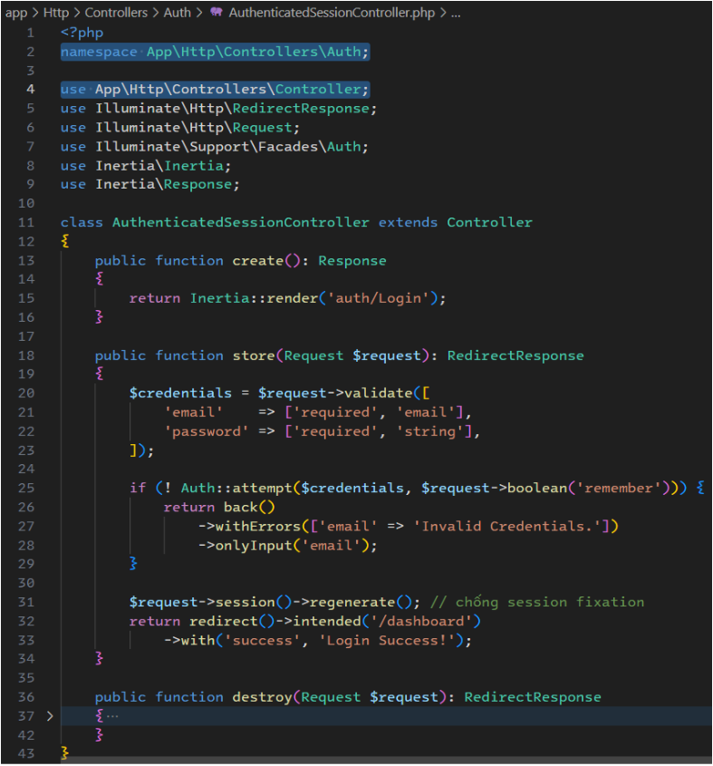

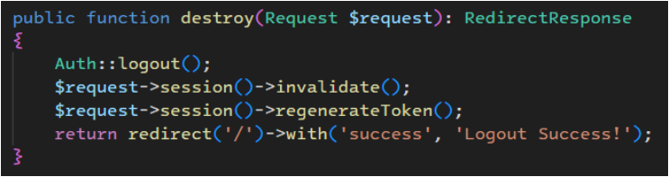

#### **Giải thích code ở trên (AuthenticatedSessionController (Login/Logout))**

## 1. Khai báo & import

```php
namespace App\Http\Controllers\Auth;

use App\Http\Controllers\Controller;
use Illuminate\Http\RedirectResponse;
use Illuminate\Http\Request;
use Illuminate\Support\Facades\Auth;
use Inertia\Inertia;
use Inertia\Response;
```

* `namespace App\Http\Controllers\Auth;` → Controller này nằm trong thư mục `app/Http/Controllers/Auth`.
* **Auth**: Facade hỗ trợ đăng nhập / đăng xuất.
* **Inertia**: Render các trang React/Vue thay cho Blade.
* **Response, RedirectResponse**: Kiểu dữ liệu trả về.

## 2. Hàm `create()`

```php
public function create(): Response
{
    return Inertia::render("auth/Login");
}
```

* Trả về component Inertia **`auth/Login`**.
* Đây là trang hiển thị form đăng nhập.

**Route tương ứng:**

```php
Route::get("/login", [AuthenticatedSessionController::class, "create"])
    ->name("login");
```

## 3. Hàm `store()`

```php
public function store(Request $request): RedirectResponse
{
    $credentials = $request->validate([
        "email" => ["required", "email"],
        "password" => ["required", "string"]
    ]);

    if (!Auth::attempt($credentials, $request->boolean("remember"))) {
        return back()
            ->withErrors(["email" => "Invalid credentials."])
            ->onlyInput("email");
    }

    $request->session()->regenerate();

    return redirect()->intended("/dashboard")
        ->with("success", "Login Success!");
}
```

* **Validate input**:

  * `email`: bắt buộc, đúng định dạng.
  * `password`: bắt buộc, chuỗi.

* **Auth::attempt(\$credentials, \$remember)**:

  * Nếu thông tin đúng → đăng nhập thành công.
  * Nếu sai → quay lại form, báo lỗi `"Invalid credentials."` và giữ lại input email.

* **`$request->session()->regenerate()`**: reset lại session ID để chống **session fixation**.

* **Redirect**:

  * Thành công → chuyển tới `/dashboard` (hoặc route intended nếu trước đó user cố vào route có middleware `auth`).
  * Flash message: `"Login Success!"`.

## 4. Hàm `destroy()`

```php
public function destroy(Request $request): RedirectResponse
{
    Auth::logout();

    $request->session()->invalidate();
    $request->session()->regenerateToken();

    return redirect("/")
        ->with("success", "Logout success!");
}
```

* `Auth::logout()` → đăng xuất user.
* `invalidate()` → hủy session hiện tại.
* `regenerateToken()` → tạo lại CSRF token mới.
* Redirect về `/` kèm flash `"Logout success!"`.

**Route tương ứng:**

```php
Route::post("/logout", [AuthenticatedSessionController::class, "destroy"])
    ->middleware("auth");
```

## Tóm tắt luồng hoạt động

1. **GET `/login`** → gọi `create()` → render form `auth/Login`.
2. **POST `/login`** → gọi `store()`:

   * Validate input.
   * `Auth::attempt()` → kiểm tra thông tin.
   * Nếu sai → quay lại form với lỗi.
   * Nếu đúng → regenerate session + login thành công → redirect `/dashboard`.
3. **POST `/logout`** → gọi `destroy()`:

   * Logout user.
   * Hủy session & CSRF token.
   * Redirect `/` kèm flash `"Logout success!"`.

---

## File: `app/Http/Middleware/HandleInertiaRequests.php`

****Inertia Share (Auth, CSRF, Flash)****

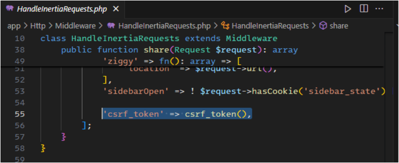


### 1. `csrf_token()` là gì?

* Đây là **helper function** được Laravel định nghĩa sẵn.
* Khi gọi, nó trả về **CSRF token** hiện tại gắn với session của user.
* Mỗi lần session gọi `regenerateToken()`, giá trị token sẽ thay đổi.

**Ví dụ:**

```php
csrf_token(); 
// "eyJpdiI6IlpQRGN6a2F... (chuỗi random dài)"
```

---

### 2. Tại sao cần CSRF Token?

* **CSRF (Cross-Site Request Forgery)** = tấn công giả mạo request từ một website khác.
* Hacker có thể tạo form giả, buộc user đang login click submit → gửi request nguy hiểm (xóa dữ liệu, đổi mật khẩu…).
* Laravel bảo vệ bằng cách **so khớp CSRF token**:

  * Khi user submit form, token được gửi kèm theo request.
  * Server so sánh token trong request với token trong session.
  * Nếu **trùng** → request hợp lệ.
  * Nếu **sai/thiếu** → Laravel trả về lỗi **419 Page Expired**.

### 3. Share dữ liệu qua Inertia

Trong `HandleInertiaRequests.php`:

```php
public function share(Request $request): array
{
    return [
        ...parent::share($request),

        // User đăng nhập hiện tại (nếu có)
        'auth' => [
            'user' => $request->user(),
        ],

        // Flash message cho UX
        'flash' => [
            'success' => fn () => $request->session()->get('success'),
            'error'   => fn () => $request->session()->get('error'),
        ],

        // CSRF token cho frontend
        'csrf_token' => csrf_token(),
    ];
}
```

### 4. Ý nghĩa các key chia sẻ

* **`auth.user`** → thông tin user hiện tại (nếu login).
* **`flash.success` / `flash.error`** → thông báo session (ví dụ: `"Login success!"`, `"Invalid credentials."`).
* **`csrf_token`** → frontend lấy token này để gửi kèm các request POST/PUT/DELETE → giúp Laravel xác thực request.

Như vậy, với middleware này, **mọi trang Inertia** sẽ luôn có sẵn props:

```js
props.auth.user
props.flash.success
props.flash.error
props.csrf_token
```

---

****Đến đây là kết thúc phần thiết kế BackEnd cho các chức năng Register/Login/Logout. Phần tiếp theo là thiết kế UI cho các chức năng này****

