# Thiết kế UI cho Login & Register:

## resources/js/Pages/Auth/Login.jsx

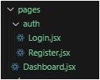

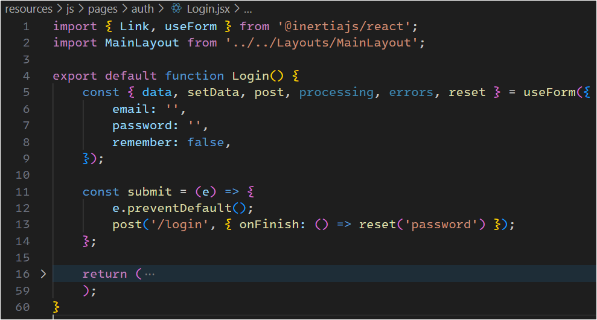

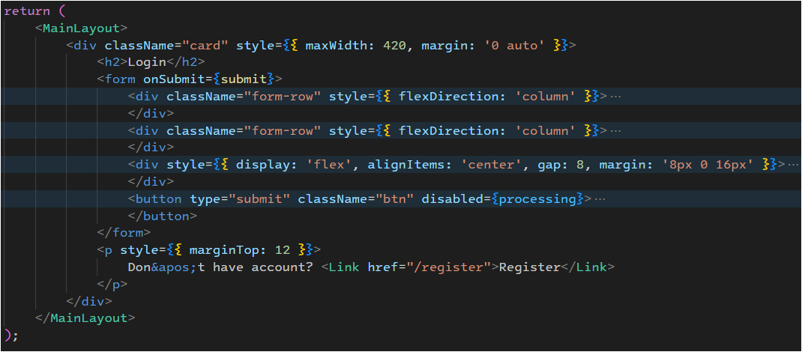

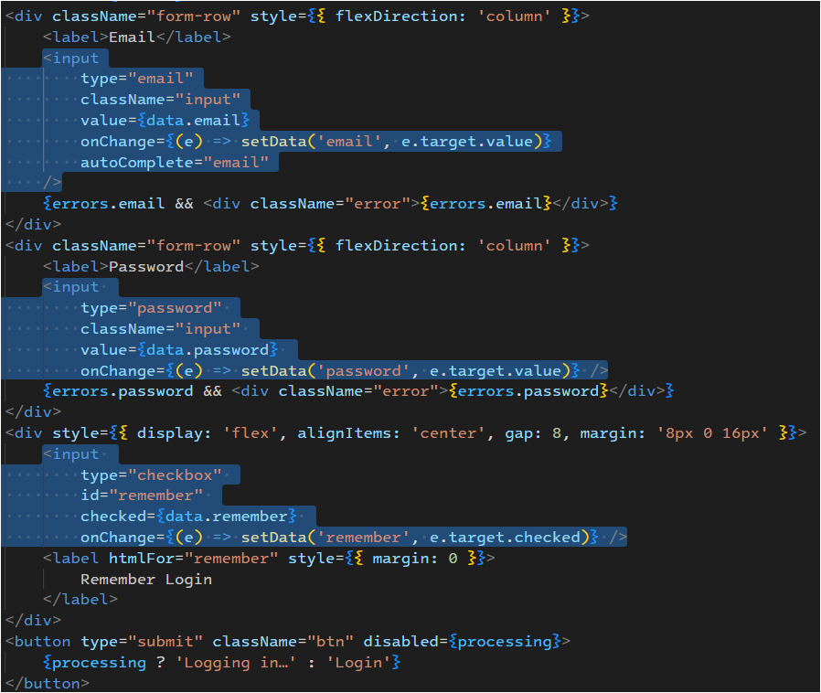

---

## resources/js/Pages/Auth/Register.jsx

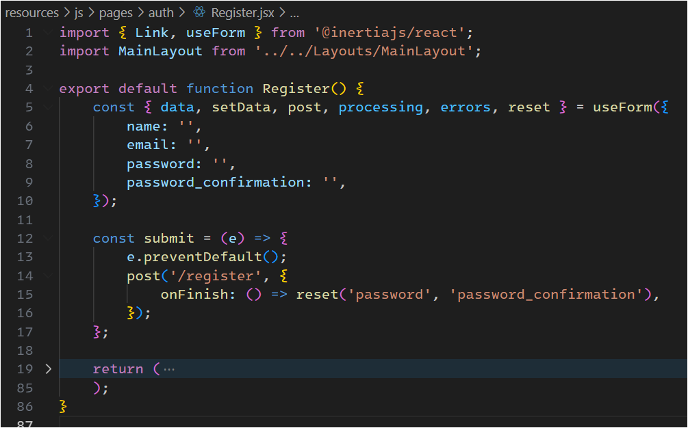

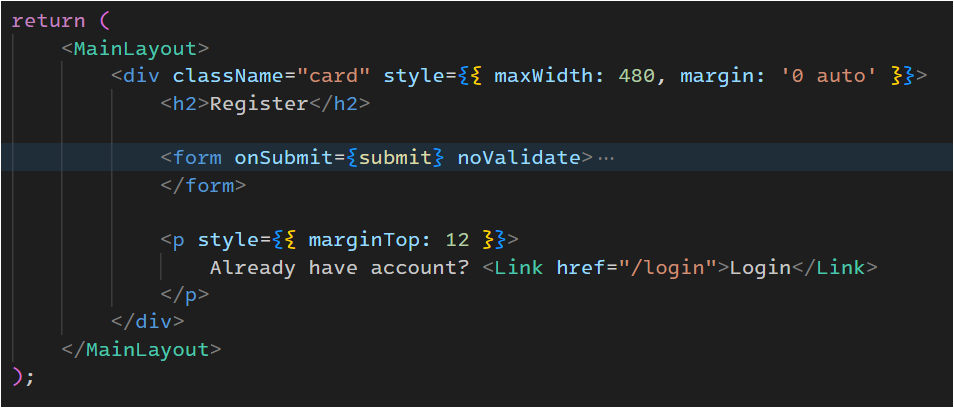

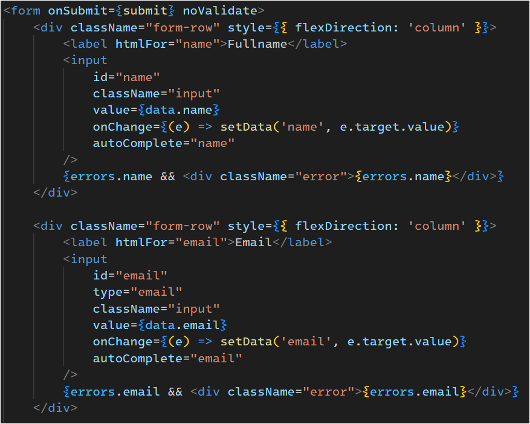

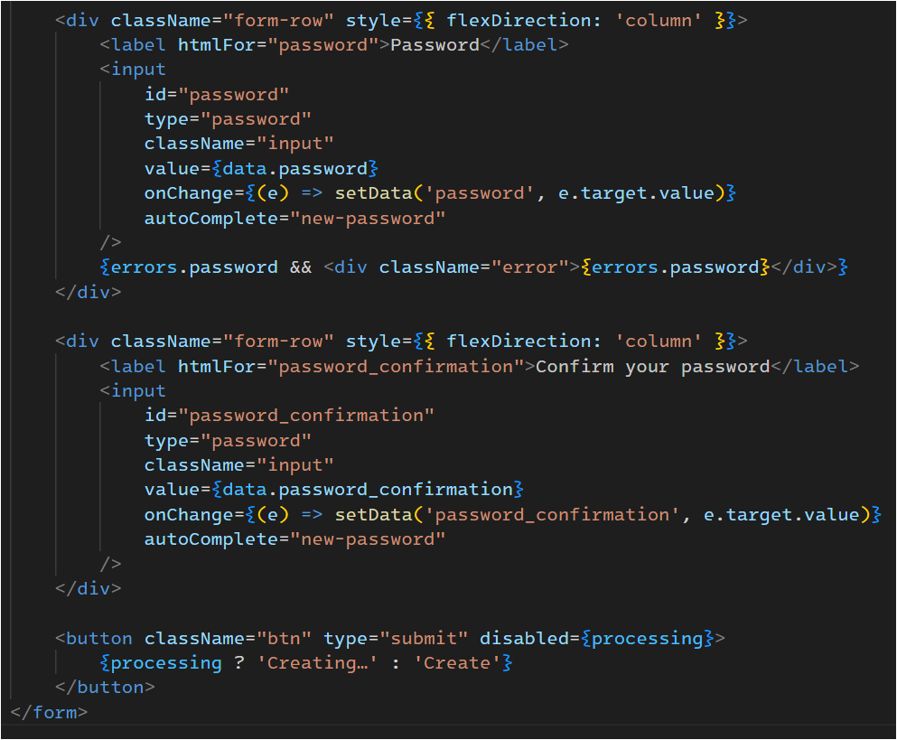

---

### Giải thích đoạn code trên:

#### Trang Login / Register (React JSX)

##### 1. Import

```jsx
import { Link, useForm } from '@inertiajs/react';
import MainLayout from '../../Layouts/MainLayout';
```

* **Link**: Dùng để chuyển trang (giống `<a>` nhưng không reload page).
* **useForm**: Hook tiện lợi của Inertia để quản lý form (state, gửi request, errors, loading).
* **MainLayout**: Layout tổng của app (header, nav, …).

##### 2. Khởi tạo state form

```jsx
const { data, setData, post, processing, errors, reset } = useForm({
  name: '',
  email: '',
  password: '',
  password_confirmation: '',
});
```

* `useForm({ ... })` khai báo dữ liệu ban đầu của form.
* Trả về nhiều tiện ích:

  * `data`: object lưu dữ liệu form (`{ name, email, password, password_confirmation }`).
  * `setData(field, value)`: cập nhật field trong form.
  * `post(url, options)`: gửi POST request đến backend.
  * `processing`: `true` khi đang gửi request (loading state).
  * `errors`: chứa lỗi validate từ backend (nếu có).
  * `reset(fields…)`: reset một số field về rỗng.

##### 3. Hàm submit

```jsx
const submit = (e) => {
  e.preventDefault();
  post('/register', {
    onFinish: () => reset('password', 'password_confirmation'),
  });
};
```

* `e.preventDefault()`: chặn reload khi submit form.
* Gửi dữ liệu đến route `/register` (Laravel nhận ở `RegisterdUserController@store`).
* `onFinish`: sau khi request xong → reset lại password và confirm password (để bảo mật, tránh lưu password trong state sau khi submit).

##### 4. Render form

```jsx
<form onSubmit={submit} noValidate>
  {/* Form sẽ gọi submit() khi bấm nút "Create". */}
  {/* noValidate: tắt validate mặc định của HTML để dùng validate từ backend. */}

  {/* Input name */}
  <input
    id="name"
    className="input"
    value={data.name}
    onChange={(e) => setData('name', e.target.value)}
    autoComplete="name"
  />
  {errors.name && <div className="error">{errors.name}</div>}

  {/* Input email */}
  <input
    id="email"
    type="email"
    className="input"
    value={data.email}
    onChange={(e) => setData('email', e.target.value)}
    autoComplete="email"
  />
  {errors.email && <div className="error">{errors.email}</div>}

  {/* Input password */}
  <input
    id="password"
    type="password"
    className="input"
    value={data.password}
    onChange={(e) => setData('password', e.target.value)}
    autoComplete="new-password"
  />
  {errors.password && <div className="error">{errors.password}</div>}

  {/* Input password_confirmation */}
  <input
    id="password_confirmation"
    type="password"
    className="input"
    value={data.password_confirmation}
    onChange={(e) => setData('password_confirmation', e.target.value)}
    autoComplete="new-password"
  />

  {/* Nút submit */}
  <button className="btn" type="submit" disabled={processing}>
    {processing ? 'Creating…' : 'Create'}
  </button>
</form>
```

* Liên kết state `data.name` → khi gõ gọi `setData('name', value)`.
* Nếu backend trả lỗi `errors.*` thì hiện message dưới input.
* Nếu đang gửi request (`processing = true`) → disable nút + hiển thị `"Creating…"`. Ngược lại hiển thị `"Create"`.

##### 5. Link chuyển sang login

```jsx
<p style={{ marginTop: 12 }}>
  Already have account? <Link href="/login">Login</Link>
</p>
```

* Nếu đã có tài khoản → click để chuyển đến `/login` (không reload trang).

##### 6. Tóm tắtL

* Người dùng nhập thông tin vào form.
* Dữ liệu lưu trong state `data` của `useForm`.
* Submit → gửi `POST /register`.
* Backend (Laravel) validate:

  * Nếu lỗi → Inertia trả `errors`, hiển thị dưới input.
  * Nếu thành công → tạo user, login, redirect `/dashboard`.
* Sau request → `reset` field password.

##### Ghi chú:

* Quản lý state form bằng `useForm`.
* Tự động bắt lỗi từ Laravel.
* Reset mật khẩu sau khi submit.
* Điều hướng qua Inertia (không reload page).

---

## Trang Dashboard: resources/js/Pages/Dashboard.jsx

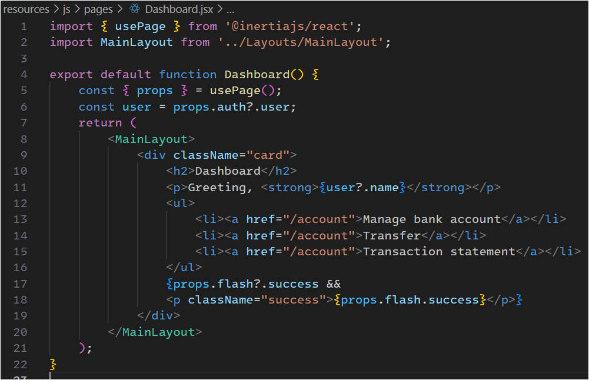

---

## Thêm Notification:

Để có thể hiển thị notification phía người dùng cần phải thêm flash (đoạn này đã thêm rồi chỉ nhắc lại)
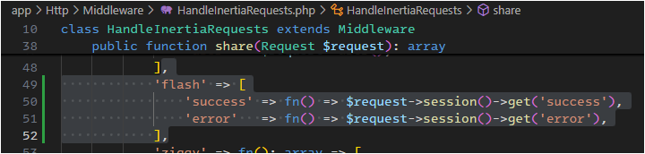

Đổi <a> thành <Link> trong Dashboard:
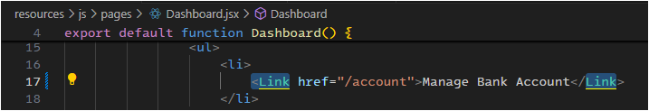

Thêm thông báo cho tất cả các component con nằm trong main layout:
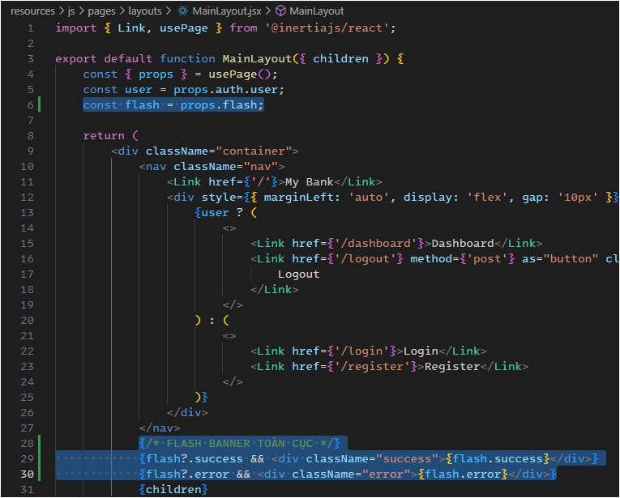

---

**Kết thúc phần thiết kế giao diện cho Login/ Register. Tiếp theo là phần Deposit và Withdraw cùng với tạo Bank Accounts.**

