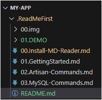
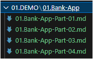

# Hướng dẫn sử dụng **My Bank App**

## Giới thiệu
Để tất cả các bạn trong lớp có thể hoàn thành dự án **My Bank**, thầy đã chuẩn bị một bộ hướng dẫn gồm **4 phần**.

- Bộ hướng dẫn được viết bằng **Markdown** (*lightweight markup language*), thường dùng kèm với source code để miêu tả hoặc hướng dẫn.
- Để bắt đầu, hãy tải về file **`my-app.zip`**.
- Bên trong sẽ có sẵn phần cài đặt và cách sử dụng trong file:  
  `00.Install-MD-Reader.md`

---

## Hướng dẫn khởi động dự án **My Bank**
Trong thư mục dự án, bạn sẽ thấy có **4 phần hướng dẫn**.  
Hãy mở từng phần theo thứ tự và làm theo hướng dẫn để hoàn thành.

Lưu ý:
- Trong mỗi phần đều có sẵn **source code minh họa**.  
- Nếu không gõ được thì có thể **copy trực tiếp** để chạy.  
- Quan trọng nhất là phải **hiểu được luồng xử lý của hệ thống** chứ không chỉ chạy code.  

---

## Source code **my-app** là gì?

Source code **my-app** đã được thầy **chỉnh sửa và hoàn thiện** với đầy đủ các **thiết lập cơ bản cần có** để bắt đầu quá trình thiết kế dự án.  

=> Các bạn có thể **tái sử dụng** source code này cho những lần thiết kế sau, giúp tiết kiệm thời gian và đảm bảo đồng nhất cấu trúc dự án.

