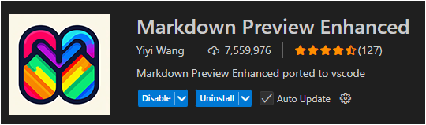

# Hướng dẫn sử dụng Markdown Preview Enhanced (VS Code)



## 1️. Cài đặt Extension

- Mở **VS Code** → `Ctrl+Shift+X` để mở tab Extensions.
- Tìm **Markdown Preview Enhanced** (tác giả: _Yiyi Wang_).
- Nhấn **Install** để cài đặt.

---

## 2. Mở Preview

Có 2 cách để mở preview:

- **Phím tắt**

    ```text
    Ctrl + Shift + V
    ```

    Mở preview Markdown cạnh file `.md`.

- **Chuột phải vào file** → chọn:
  **Markdown Preview Enhanced: Open Preview**

Lưu ý: Preview mặc định của VS Code (biểu tượng cuốn sách) **không render được Mermaid**. Hãy chắc chắn dùng preview của extension **Markdown Preview Enhanced**.

---

## 3. Vẽ Mermaid Diagram trong Markdown

Trong file `README.md`, chèn code block như sau:


Khi mở preview, đoạn code trên sẽ hiển thị thành sơ đồ flowchart trực quan.

---

## 4. Tùy chỉnh giao diện bằng CSS

Markdown Preview Enhanced cho phép chỉnh giao diện preview thông qua file CSS.

### Bước 1: Mở file cấu hình CSS

- `Ctrl + Shift + P` → gõ **Markdown Preview Enhanced: Customize CSS**.
- VS Code sẽ mở file `custom.css` để chỉnh style.

### Bước 2: Viết CSS tuỳ biến

```css
.markdown-preview.markdown-preview {
  background-color: #cccccc;
}
.markdown-preview.markdown-preview code {
  font-family: "Intel One Mono";
}
```

### Bước 3: Reload VS Code

- Sau khi chỉnh CSS, reload lại VS Code (`Ctrl+Shift+P` → **Reload Window**).
- Mở lại preview, giao diện sẽ thay đổi theo style mới.

---

## 5. Xuất tài liệu

Markdown Preview Enhanced còn hỗ trợ export file Markdown sang nhiều định dạng:

- HTML
- PDF
- Word (.docx)

Trong preview, **chuột phải** -> **Export** -> chọn định dạng mong muốn.

---
